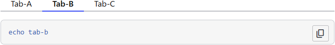
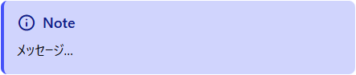
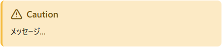
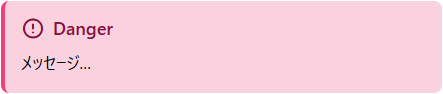
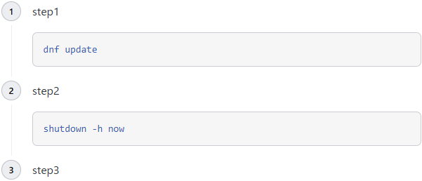
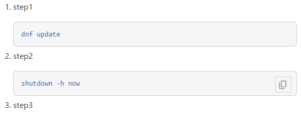

# Notey
Noteyは、Hugo向けに設計された軽量なドキュメント指向テーマです。基本的な `CSS` / `JavaScript` のみで構成されており、複雑なビルド設定なしで、すぐにドキュメントサイトを構築できます。

Tauri のドキュメントサイトで採用されている Starlight を参考に、コンテンツの可読性とナビゲーションの分かりやすさを重視したデザインを採用しています。

## Notey導入準備

### 必要なコマンドのインストール
本テーマはHugo Modules前提に設計されているため、下記のツールをインストールし、PATHを通しておいてください。

 * [Go](https://go.dev/doc/install)
 * [Hugo](https://gohugo.io/installation/)
 * Git

### Hugoサイトの作成
Noteyを導入するためのHugoサイトを作成してください。

```bash
hugo new site "<site name>"
```

上記コマンドで作成したディレクトリ配下に移動して作業を行うようにしてください。

```sh
cd "<site name>"
```


### リポジトリの作成
Noteyは記事の更新日時などはGitで管理しているため、初期リポジトリは作成しておいてください。

```
git init
git add .
git commit
```

## Notey本体の導入

### Hugo Modulesを利用する準備
Hugo Modulesの利用を前提として設計されているため、このサイトをモジュールとして初期化します。

```bash
### 名前は何でもいい
hugo mod init "<your module name>"
```

### Hugoの設定ファイルを修正
`hugo new site ...` で作成すると、デフォルトの設定ファイルである `hugo.toml` が作成されます。そちらの設定ファイルを修正することで、設定を変更できますが、今回はyaml形式でのサンプルを例として説明します。

```yaml
baseURL: http://localhost:1313/
languageCode: en-US
title: Notey

# Gitを有効化. git init を済ませておくこと!
enableGitInfo: true

# コードハイライト設定
markup:
  highlight:
    noClasses: false
    style: none
    codeFences: true

# テーマ
module:
  imports:
    # NoteyのURLをここに記載する
    - path: github.com/ochipin/notey
  # 必要であれば、 themes/ ディレクトリ配下にNoteyをインストールして利用する
  #replacements:
    #- github.com/ochipin/notey -> notey

# 検索用のJSONファイル出力設定
outputs:
  home: ["HTML", "JSON"]
outputFormats:
  JSON:
    mediaType: application/json
    baseName: search
    isPlainText: true

# デフォルト言語の設定
defaultContentLanguage: ja
defaultContentLanguageInSubdir: true
# 多言語設定
languages:
  ja:
    languageName: 日本語
    languageCode: ja-JP
    weight: 1
  en:
    languageName: English
    languageCode: en-US
    weight: 2
```

### Hugo Modulesのインストール
下記コマンドを実行すると、設定ファイルの `module` に記載したテーマをインストールします。

```
hugo mod tidy
```

### Hugoサーバの起動
下記コマンドでサーバを起動後、 http://localhost:1313 で確認できます。

```
hugo server --renderToDisk --cleanDestinationDir --bind 0.0.0.0
```

※ `--bind 0.0.0.0` は、他の端末やコンテナ環境からアクセスするために指定しています。

## 記事を編集する
記事の構成は以下の通りです。

```bash
content/
  +-- _index.md ### HOME画面
  +-- category1/
  |     +-- _index.md ### カテゴリアイコンの設定等を行う
  |     +-- page.md   ### 記事の本文
  |     `-- nested/
  |           `-- _index.md ### 階層構造
  `-- category2/
        `-- ...
```

### HOME画面の変更方法
content/_index.md (多言語の場合は index.ja.md, index.en.md など) を編集することで、ホーム画面を編集できます。
編集方法は、テーマ内のcontent/_index.mdを参考にしてください。

### _index.mdの編集
各ディレクトリ配下の_index.mdは、アイコンやタイトルだけを設定します。

```yaml
title: "Guides"
icon: "book"
```

直接記事の内容を持たない設定ファイルとなっている点にご注意ください。

### <page>.mdの編集
Front Matterには以下を記載できます。

```yaml
title: ''    # 記事のタイトル
weight: 0    # 並び順
draft: true  # 記事執筆中か否か
#slug: ""    # URLを変更する場合は、ここに記載する
#date: ""    # Gitの日時を使用しない場合は、ここに記載する
```

## Shortcodes

### タブ
`` を使用することで記事内にタブ型の文書を記載できます。

#### 記載例
~~~html

```bash
echo tab-a
```




```bash
echo tab-b
```




```bash
echo tab-c
```

~~~

#### 表示例


### ノート
~~~html

メッセージ

~~~


### Tips
~~~html

メッセージを記載

~~~


### 警告メッセージ
~~~html

メッセージを記載

~~~



### 危険
~~~html

メッセージを記載

~~~



### 通常の数字付きリスト
基本的に数字付きのリストはデフォルトでステップとして表示するようにデザインされています。



ステップ用のデザインを解除したい場合は、次のように`{{num}}`で囲うことで解除できます。

#### 記載例
~~~html

1. step1
   ```text
   dnf update
   ```
2. step2
   ```sh
   shutdown -h now
   ```
3. step3

~~~

#### 表示例

