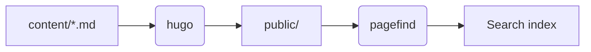

## Notes


Add supplementary information here.



Share helpful tips here.



Highlight anything that needs extra care.



Warn about actions that cannot be undone.


## Tabs


```bash
brew install hugo
```



```bash
sudo dnf install hugo
```



```powershell
winget install Hugo.Hugo.Extended
```


## Collapsible sections

```details {title="Show the full configuration"}
This is the content of a collapsible section. You can use Markdown here.
```

## Diagrams (Mermaid)

The theme includes Mermaid 12.0.0. It loads locally only on pages with diagrams, so diagrams also display offline.


