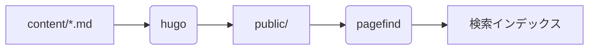

## ノート


補足情報を書きます。



知っておくと便利なことを書きます。



注意が必要なことを書きます。



取り返しがつかない操作の警告を書きます。


## タブ


```bash
brew install hugo
```



```bash
sudo dnf install hugo
```



```powershell
winget install Hugo.Hugo.Extended
```


## 折り畳み

```details {title="設定の全文を表示する"}
折り畳みの中身です。Markdown がそのまま書けます。
```

## 図（Mermaid）


