## Formula

Inline \(\sqrt{x^2+y^2}\) and currency $500, $600; shell `$HOME`.

$$
x = \frac{-b \pm \sqrt{b^2-4ac}}{2a}
$$

\[
\begin{pmatrix}1 & 2 \\ 3 & 4\end{pmatrix}
\]

```math
\sum_{i=1}^{n} i = \frac{n(n+1)}{2}
```

```markdown
\(\sqrt{x}\)
$$ \frac{1}{2} $$
```



Inline \(\sqrt{a}\).

$$\int_0^1 x^2\,dx = \frac{1}{3}$$



$$\underbrace{a+a+a+a+a+a+a+a+a+a+a+a+a+a+a+a+a+a+a+a+a+a+a+a+a+a+a+a+a+a+a+a+a+a+a+a+a+a}_{\text{a deliberately wide formula}}$$



## flow

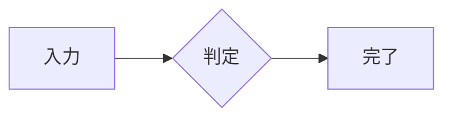

## sequence

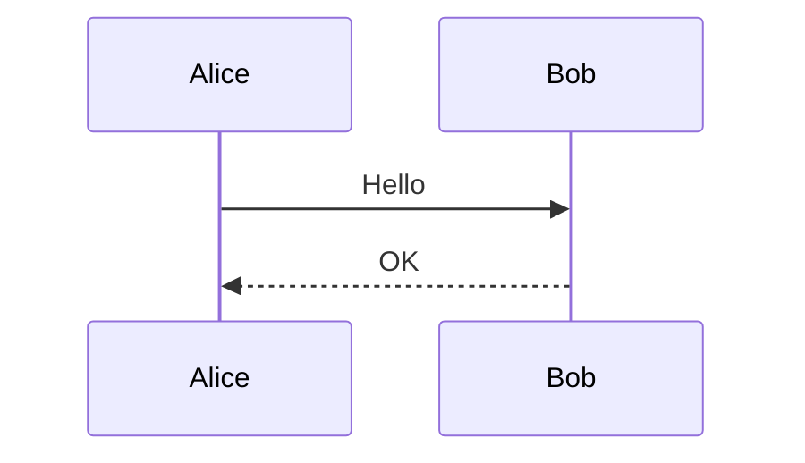

## class

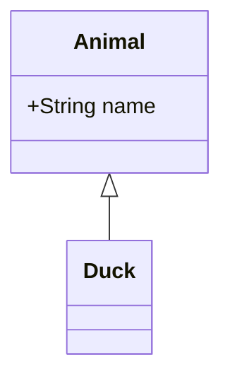

## er

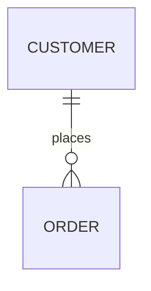

## state

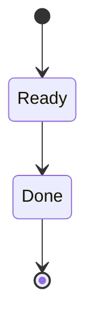

## gantt

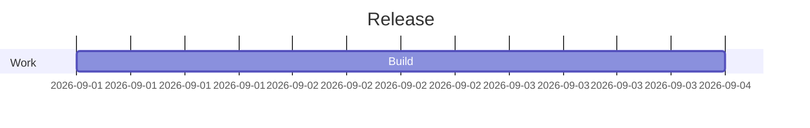

## pie

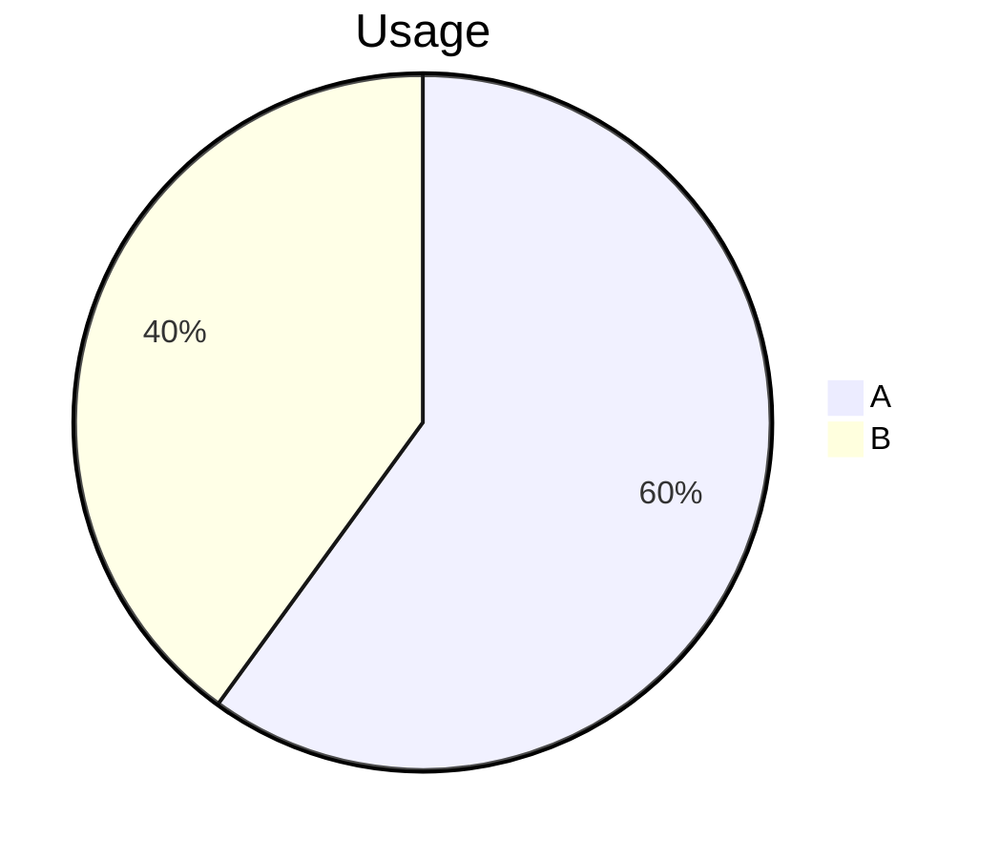

## mindmap

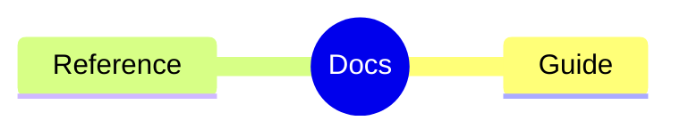

## elk

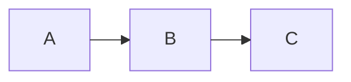

## math-label

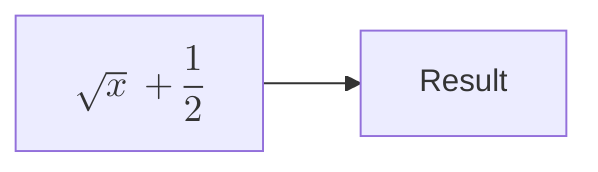

## broken

```mermaid
flowchart LR
  A[unclosed
```

## after-broken

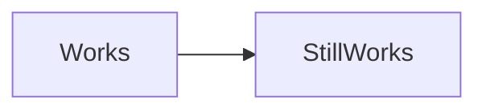

